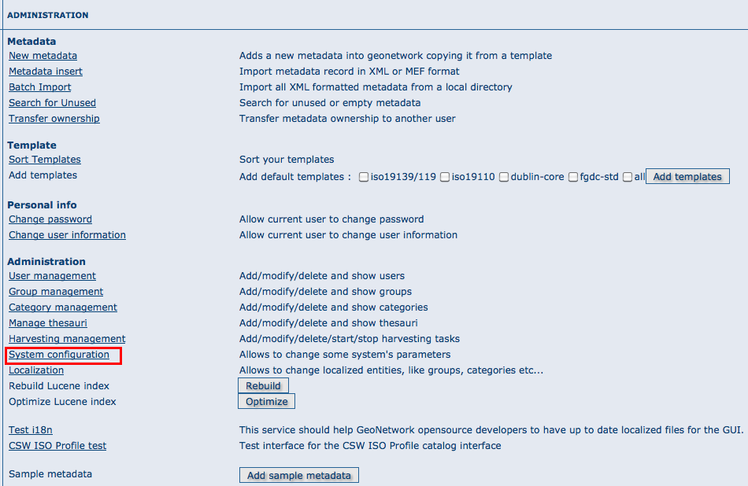
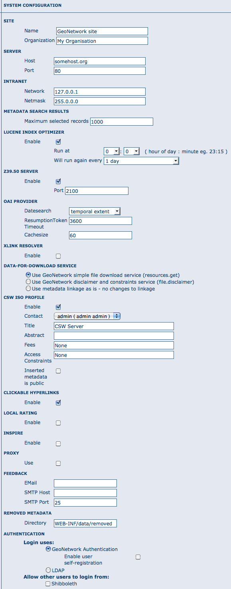
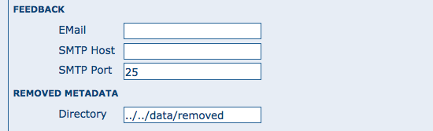
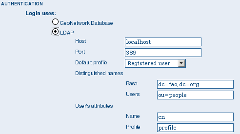

.. _configuration:

.. toctree::
   :maxdepth: 2

Basic configuration
===================

System configuration
--------------------

Most of the GeoNetwork system configuration parameters can be changed using the
web interface. Those parameters that cannot be changed through the web interface can
usually be changed using the GAST application.

.. important:: Configuration of these parameters is critically important for a proper
   functioning of the GeoNetwork catalogue in an operational context. Failing to
   properly change these settings may result in a system that does not function as
   expected. For example, downloads may fail to be correctly processed, or metadata
   harvesting from other servers may not work.

To get to the System configuration, you must be logged on as administrator first. Open the Administration page and select System configuration (The link is surrounded with a red rectangle).

.. important:: New installations of GeoNetwork use admin for both username
   and password. It is important to change this from the Administration page once
   you logged on!



    *The link to the System configuration page*

Clicking the page’s link you will get the set of parameters that you can change. Here follows a detailed description of them:



    *The configuration options*

At the bottom of the page there are some buttons with the following purpose:

Back Simply returns to the main administration page. Save Saves the current
options. If some options are invalid, the system will show a dialogue with the wrong
parameter and will focus its text field on the page. Once the configuration is saved
a success dialogue will be shown. Refresh This button simply refreshes the displayed
options taking the new values from the server. This can be useful if some options
get changed dynamically (for example by another user).

Public host and port usage

Up to now, the server’s host and port are used in these cases:

#. During an editing session, when adding data links to a metadata. The host and port will be used to build download links to store inside the metadata.

#. During CSW requests. The GetCapabilities operation returns an XML document with HTTP links to the CSW services. These links are dynamically built using the host and port values.

Site General site parameters
````````````````````````````

*Name* The name of the GeoNetwork installation. This name will be used to identify the node in operations like the harvesting.

*Organization* The organization the node belongs to. Just for informative reasons.

*Server* Here you have to enter the address of your GeoNetwork’s node. This address is important because it will be used to access the node.

*Host* The node’s address or IP number. If your node is publicly accessible from the Internet, you have to use the machine’s domain/address. If your node is hidden into your private network and you have a firewall or web server that redirects incoming calls to the node, you have to enter the public address of the firewall or web server. A typical configuration is to have an Apache web server on address A that is publicly accessible and redirects the requests to a Tomcat server on a private address B. In this case you have to enter A in the host parameter.

*Port* The node’s port (usually 80 or 8080). If the node is hidden, you have to enter the port on the public firewall or web server.

*Intranet* A common need for an organisation is to discriminate between internal anonymous users (users that access the node from within the organisation) and external ones (users from the Internet). Node’s administrators can specify different privileges for internal and external anonymous users and, in order to do so, they have to specify the parameters of the internal network.

*Network* The internal network’s address in IP form.

*Netmask* The network’s mask.

Catalogue services (CSW, Z39.50)
````````````````````````````````

OGC CSW configuration
~~~~~~~~~~~~~~~~~~~~~

See :doc:`../cswserver/index`

Z39.50 configuration
~~~~~~~~~~~~~~~~~~~~

*Z39.50*: GeoNetwork can act as a Z39.50 server, which
is an OGC communication protocol to query and retrieve metadata.

*Enable*: Check this option to start the Z39.50
submodule. Please, notice that GeoNetwork must be restarted in order to make
this change active.

*port*: This is the port on which GeoNetwork will be
listening for incoming Z39.50 requests. Usually, the value of 2100 is a
standard one, but to have multiple GeoNetwork nodes on the same machine you
have to change this value in order to avoid port conflicts between the
different nodes.

Clickable hyperlinks
````````````````````
Enables/disables hyperlinks in metadata content for urls.

INSPIRE
```````
Enables/disables the INSPIRE search options in advanced search panel.

Proxy configuration
```````````````````

*Proxy*: In some occasions (like harvesting) GeoNetwork must
be able to connect to remote sites and this may be denied if an organisation
uses proxy servers. In this cases, GeoNetwork must be configured to use the
proxy server in order to route outgoing requests.

.. figure:: web-config-options-proxy.png

    *The proxy configuration options*

*Host*: The proxy’s name or address to use (usually an IP address).

*Port*: The proxy’s port to use.

*Username* (optional): a username should be provided if the proxy server requires authentication.

*Password* (optional): a password should be provided if the proxy server requires authentication.

Email & notification
````````````````````

*Feedback* GeoNetwork can sometimes send email, for example if a metadata is downloaded or
if a user provides feedback using the online form. You have to configure
the mail server GeoNetwork should use in order to enable it to send email.



    *The mail server configuration options*

*Email*: This is the email address that will be used to send
the email (the From address).

*SMTP host*: the mail server address to use when sending
email.

*SMTP port*: the mail server SMTP port (usually 25).

Removed metadata
````````````````

Defines the directory used to store a backup of metadata and data after a delete action. This
directory is used as a backup directory to allow system administrators to recover metadata and possibly
related data after erroneous deletion. By default the removed directory
is created under the data folder

Authentication
``````````````

In this section you define the source against which GeoNetwork will authenticate users and passwords.

.. figure:: web-config-options-authentication.png

    *Authentication configuration options*

By default, users are authenticated against info held in the GeoNetwork database. When the GeoNetwork database is used as the authentication source, the user self-registation function can be enabled.

You may choose to authenticate logins against either the GeoNetwork database tables or LDAP (the lightweight directory access protocol) but not both. The next section describes how to authenticate against LDAP.

In addition to either of these options, you may also configure other authentication sources. At present, Shibboleth is the only additional authentication source that can be configured. Shibboleth is typically used for national access federations such as the Australian Access Federation. Configuring shibboleth authentication in GeoNetwork to use such a federation would allow not only users from a local database or LDAP directory to use your installation, but any user from such a federation.

LDAP Authentication
~~~~~~~~~~~~~~~~~~~

The section defines how to connect to an LDAP authentication system.



    *The LDAP configuration options*

Typically all users must have their details in the LDAP directory to login to GeoNetwork. However if a user is added to the GeoNetwork database with the Administrator profile then they will be able to login without their details being present in the LDAP directory.

Shibboleth Authentication
~~~~~~~~~~~~~~~~~~~~~~~~~

When using either the GeoNetwork database or LDAP for authentication, you can also configure shibboleth to allow authentication against access federations.

.. figure:: web-config-options-shibboleth.png

    *The Shibboleth configuration options*

Shibboleth authentication requires interaction with Apache web server. In particular, the apache web server must be configured to require Shibboleth authentication to access the path entered in the configuration. The apache web server configuration will contain the details of the shibboleth server that works out where a user is located (sometimes called a 'where are you from' server).

The remainder of the shibboleth login configuration describes how shibboleth authentication attributes are mapped to GeoNetwork user database fields as once a user is authenticated against shibboleth, their details are copied to the local GeoNetwork database.
