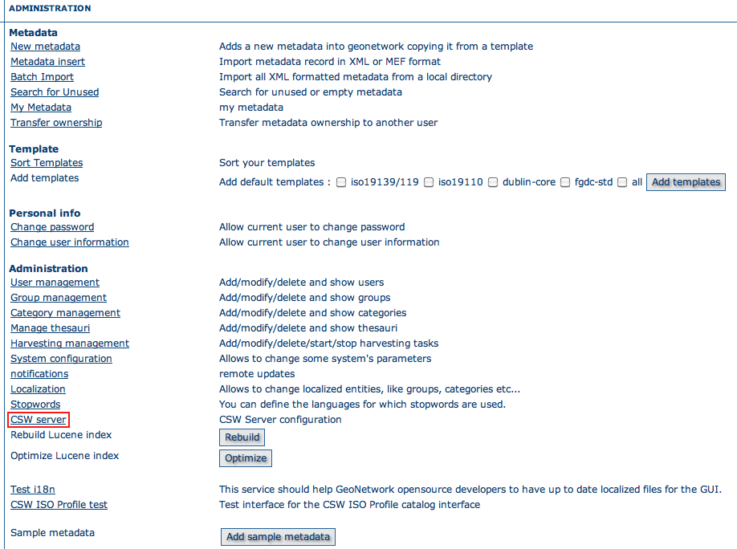

.. _csw_server:

OGC CSW Server configuration
============================

When using Open Geospatial Catalogue Service for the Web (OGC-CSW) service,
a client will ask for a description of the
service. This description, provided in the form of a GetCapabilities document, describes
the main service's properties. 

.. figure:: csw-server-config.png

The CSW server section allows configuration of the following CSW properties:

* *Enable*: This option allows you to start or stop the CSW services. If this option is disabled, other catalogues cannot connect to the node using CSW protocol.

* *Inserted metadata is public*: By default, metadata inserted with CSW Transaction operation is not  public viewable unless a user with proper rights, sets later the metadata permissions to be public  viewable. If this option is checked all metatada inserted with CSW Transation is public viewable by default.

* *Contact*: The main contact who is defined in the GetCapabilities document of the CSW service. This contact is one user of the catalogue.

* *Title*: The title of your CSW service.

* *Abstract*: The abstract of your CSW service.

* *Fees*

* *Access constraints*

The properties *Title*, *Abstract*, *Fees* and *Access constraints* can be configured in the languages supported by GeoNetwork GUI. When the user asks for the Capabilities document
the values are returned in the language used in the URL:

* ``http://SERVER/geonetwork/srv/en/csw?request=GetCapabilities&...`` , returns the Capabilities document with english values

* ``http://SERVER/geonetwork/srv/**fr**/csw?request=GetCapabilities&...`` , returns the Capabilities document with french values

When INSPIRE is enabled and is provided the language parameter in the Capabilities URL it is used the value of this parameter. For example:

* ``http://SERVER/geonetwork/srv/fr/csw?request=GetCapabilities&...&language=eng`` , returns the Capabilities document with english values

The service description also contains the main keywords of the catalogue.
The list of keywords is generated by the catalogue based on metadata
content.

.. COMMENT: TODO : Add documentation about config-csw.xml options
