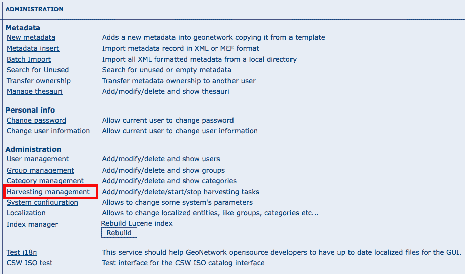

.. _harvesting:

Harvesting
==========

Introduction
------------

Since the beginning of the project, there has been the need to share metadata
among several GeoNetwork nodes. Usually, each node takes care of a region of
interest so it is important to be able to perform a search over all these nodes at
the same time. This is called distributed search and exploits the Internet
connectivity. In our cases, this distributed search can be heavy to perform if there
are many maps with associated thumbnails. Furthermore, GeoNetwork is usually
employed in areas (like Africa, Asia) where the connectivity can be limited, making
the use of distributed search not feasible.

Harvesting is the process of collecting remote metadata and storing them
locally for a faster access. This is a periodic process to do, for example, once a
week. Harvesting is not a simple import: local and remote metadata are kept aligned.
Using some *magic*, one GeoNetwork node is capable of discovering metadata
that have been added, removed or updated in the remote node.

GeoNetwork is able to harvest from the following sources (for more details see below):

#. Another GeoNetwork node (version 2.1 or above).
#. An old GeoNetwork 2.0 node.
#. A WebDAV server.
#. A CSW 2.0.1 or 2.0.2 catalogue server.
#. An OAI-PMH server.
#. An OGC service using its GetCapabilities document. These include WMS, WFS, WPS and WCS services.
#. An ArcSDE server.

Mechanism overview
------------------

The harvesting mechanism is based on the concept of a *universally unique identifier (UUID)*.
This is a special id because it is not only
unique locally to the node that generated it but it is unique across all the world.
It is a combination of the network interface’s MAC address, the current date/time
and a random number. Every time you create a new metadata in GeoNetwork, a new UUID
is generated and assigned to it.

Another important concept behind the harvesting is the *last change date*.
Every time you change a metadata, its last change date is
updated. Just storing this parameter and comparing it with a new one allows any
system to find out if the metadata has been modified since last update.

These two concepts allow GeoNetwork to fetch a remote metadata, check if it has
been updated and remove it locally if it has been removed remotely. Furthermore,
thanks to UUIDs, a hierarchy of harvesting nodes can be built where B harvests from
C and A harvests from B. Even loops can be created because harvested metadata cannot
be modified.

Harvesting life cycle
---------------------

When a harvesting node is set, there is no harvested metadata. During the first
run, all remote matching metadata are retrieved and stored locally. After the first
run, only changed metadata are retrieved. Harvested metadata are not editable for
the following reasons:

#. The harvesting is periodic so any local change to harvested metadata will be lost during the next run.
#. The change date is used to keep track of changes so if it gets changed outside the originator site, the harvesting mechanism is compromised.

Beside the metadata itself, this implies that users cannot change all other metadata properties (like categories, privileges etc...).

The harvesting process goes on until one of the following situations arises:

#. An administrator stops (deactivates) the node.
#. An exception arises. In this case the node is automatically stopped.

When a harvesting node is removed, all harvest metadata are removed too.

Multiple harvesting and hierarchies
-----------------------------------

Catalogues that provide UUIDs for metadata (for example GeoNetwork and a CSW
server) can be harvested several times without having to take care about metadata
overlap. This allows the possibility to perform a thematic search and a metadata
belonging to multiple searches is harvested only once and not duplicated.

This mechanism allows the GeoNetwork harvesting type to be combined with other
GeoNetwork nodes to perform hierarchical harvesting. This way a metadata can be
harvested from several nodes. For example, consider this scenario:

#. Node (A) has created metadata (a)
#. Node (B) harvests (a) from (A)
#. Node (C) harvests (a) from (B)
#. Node (D) harvests from both (A), (B) and (C)

In this scenario, Node (D) will get the same metadata (a) from all 3 nodes (A),
(B), (C). The metadata will flow to (D) following 3 different paths but thanks to
its UUID only one copy will be stored. When (a) will be changed in (A), a new
version will flow to (D) but, thanks to the change date, the copy in (D) will be
updated with the most recent version.

General notes and issues
------------------------

General
```````

#. The harvesting engine does not store harvesting results. This implies that if the server is restarted the last results are lost.

#. Changes to the harvesting parameters (for example privileges and categories) are taken into account in the next harvesting run.

GeoNetwork harvesting type
``````````````````````````

#. During harvesting, site icons are harvested and local copies updated. Icons are propagated to new nodes as soon as these nodes harvest from this one.
#. The metadata UUID is taken from the info.xml file of the MEF bundle. Any UUID stored inside the metadata will be overwritten with this one.

WebDAV harvesting type
``````````````````````

#.  The same metadata could be harvested several times by different
    harvesting nodes. Anyway, this is not a good practise because every copy
    of the metadata will have a different UUID and the system will fill with
    different copies of the same metadata.

CSW harvesting type
```````````````````

#.  If the dct:modified element is missing from the GetRecords response
    the metadata will be always harvested.
#. Any exception during getRecordById operation is discarded and the metadata skipped.

OAI-PMH harvesting type
```````````````````````

#.  The id of the remote server must be a UUID. If not, metadata can be
    harvested but during hierarchical propagation id clashes could corrupt
    harvested metadata.
#.  During harvesting, GeoNetwork will try to auto detect the schema of
    each metadata. If the schema is not supported the metadata is
    skipped.

OGC service harvesting type
```````````````````````````

#.  Every time the harvester runs, it will remove previously harvested information
    and create new ones. GeoNetwork will generate the id for all metadata (both service and datasets).
    Therefor, for datasets, if the metadata is created using a remote XML document (ie.
    if a MetadataUrl tag is in the GetCapability document), the UUID of
    the document is used.
#.  Thumbnails are generated only for Web Map Service (WMS). The service should also support
    the WGS84 projection

The main page
-------------

To access the harvesting main page you have to be logged in as an administrator.
From the administration page, click the link shown below with a red rectangle.



    *How to access the harvesting main page*

The figure above shows the harvesting main page. The page shows a list of harvesting nodes that have been created so far. On the bottom side there is a set of buttons to manage these nodes. The meaning of each column is as follows:

#. *Select* This is just a check box to select one or more nodes. The selected nodes will be affected by the first row of buttons (start, stop, run, remove). For example, if you select 3 nodes and press the Remove button, these 3 nodes will be removed.
#. *Name* This is the node’s name provided by the administrator.
#. *Type* The node’s harvesting type chosen when the node was created (GeoNetwork, web folder etc...).
#. *Status* This is an icon that reflects the node’s current status. See :ref:`admin_harvesting_status` for all different icons and status description.
#. *Errors* This column reflects the status of the last harvesting run, which could have succeeded or not. The result is reflected on this icon and a tool tip will show detailed information.
#. *Every* The time (in days, hours, minutes) between two consecutive harvesting from this node.
#. *Last run* The date, in ISO 8601 format, of the most recent harvesting run.
#. *Operation* A list of buttons for all possible operations on a node.
#. Selecting *Edit* will allow you to change the parameters for a node.

.. figure:: web-harvesting-list.png

    *The harvesting main page*

The bottom side of the page contains two rows of buttons. The first row contains buttons
that can operate on a set of nodes. You can select the nodes using the check box on the first
column and then press the proper button. When the button finishes its action, the check boxes
are cleared. Here is the meaning of each button:

#.  *Activate* When a new harvesting node is created, it’s status is
    *inactive*. Use this button to make it
    *active* and thus to start harvesting from the remote node.

#.  *Deactivate* Stops harvesting from a node. Please notice that this does not mean that
    a currently running harvesting will be stopped but it means that this node will be
    ignored during future harvesting.

#.  *Run* This button simply tells the harvesting
    engine to start harvesting immediately. This is useful for testing during the
    harvesting setup.

#.  *Remove* Remove all currently selected nodes. A dialogue will ask the
    user to confirm the action.

The second row contains general purpose buttons. Here is the meaning of each button:

#.  *Back* Simply returns to the main administration page.

#.  *Add* This button allows to create new harvesting nodes.

#.  *Refresh* Refreshes the current list of nodes querying the server. This
    can be useful to see if the harvesting list has been altered by someone else or if
    any harvesting process started.

.. |fcl| image:: icons/fileclose.png
.. |clo| image:: icons/clock.png
.. |exe| image:: icons/exec.png

=====    ========    =======================================================
Icon     Status      Description
=====    ========    =======================================================
|fcl|    Inactive    The harvesting from this node is stopped.
|clo|    Active      The harvesting engine is waiting for the timeout 
                     specified for this node. When the timeout is reached, 
                     the harvesting starts.
|exe|    Running     The harvesting engine is currently running, fetching 
                     metadata from remote nodes. When the process will be 
                     finished, the status will be switched to active.
=====    ========    =======================================================

*Possible status icons*

.. |ok| image:: icons/button_ok.png
.. |imp| image:: icons/important.png

=====    ==============================================================
Icon     Description
=====    ==============================================================
|ok|     The harvesting was OK, no errors were found. In this case, a
         tool tip will show some harvesting results (like the number of
         harvested metadata etc...).
|imp|    The harvesting was aborted due to an unexpected condition. In
         this case, a tool tip will show some information about the
         error.
=====    ==============================================================

*Possible error icons*

Harvesting result tips
``````````````````````

If the harvesting succeeds, a tool tip will show detailed information about the
harvesting process. This way you can check if the harvester worked as expected
or if there is something to fix to the harvesting parameters or somewhere else.
The result tip is like a table, where each row refers to

Total This is the total number of metadata found remotely. Metadata with the
same id are considered as one. Added Number of metadata added to the system
because they were not present locally. Removed Number of metadata that have been
removed locally because they are not present in the remote server anymore.
Updated Number of metadata that are present locally but that needed to be
updated because their last change date was different from the remote one.
Unchanged Local metadata left unchanged. Their remote last change date did not
change. Unknown schema Number of skipped metadata because their format was not
recognised by GeoNetwork. Unretrievable Number of metadata that were ready to be
retrieved from the remote server but for some reason there was an exception
during the data transfer process. Bad Format Number of skipped metadata because
they did not have a valid XML representation. Does not validate Number of
metadata which did not validate against their schema. These metadata were
harvested with success but skipped due to the validation process. Usually,
there is an option to force validation: if you want to harvest these metadata
anyway, simply turn it off.

==============================   ==========  ======     ======   =======  ===========
Result vs harvesting type        GeoNetwork  WebDAV     CSW      OAI-PMH  OGC Service
==============================   ==========  ======     ======   =======  ===========
Total                            |ok|        |ok|       |ok|     |ok|     |ok|  
Added                            |ok|        |ok|       |ok|     |ok|     |ok|  
Removed                          |ok|        |ok|       |ok|     |ok|     |ok|  
Updated                          |ok|        |ok|       |ok|     |ok|     
Unchanged                        |ok|        |ok|       |ok|     |ok|    
Unknown schema                   |ok|        |ok|       |ok|     |ok|     |ok|  
Unretrievable                    |ok|        |ok|       |ok|     |ok|     |ok|  
Bad Format                                   |ok|                |ok|  
Does Not Validate                            |ok|                |ok|  
Thumbnails / Thumbnails failed                                            |ok|  
Metadata URL attribute used                                               |ok|  
==============================   ==========  ======     ======   =======  ===========


*Result information supported by harvesting types*

Adding new nodes
----------------

The Add button in the main page allows you to add new harvesting nodes. It will
open the form shown in :ref:`admin_harvesting_add`.
When creating a new node, you have to choose the harvesting protocol supported
by the remote server. The supported protocols are:

#.  *GeoNetwork 2.1 remote node* 
        This is the standard and most powerful harvesting protocol used in GeoNetwork. 
        It is able to log in into the remote node, to perform
        a standard search using the common query fields and to import all matching metadata.
        Furthermore, the protocol will try to keep both remote privileges and categories of
        the harvested metadata if they exist locally. Please notice that since GeoNetwork 2.1
        the harvesting protocol has been improved. This means that it is not possible to use
        this protocol to harvest from version 2.0 or below.

#.  *WebDAV server*
        This harvesting type
        uses the webDAV (Distributed Authoring and Versioning) protocol to harvest metadata
        from a DAV server. It can be useful to users that want to publish their metadata
        through a web server that offers a DAV interface. The protocol allows to retrieve
        the contents of a web page (a list of files) with their change date.

#.  *Catalogue Services for the Web 2.0*
        The Open Geospatial Consortium
        Catalogue Services for the Web and it is a search interface for catalogues developed by
        the Open Geospatial Consortium. GeoNetwork implements version 2.0 of this protocol.

#.  *GeoNetwork v2.0 remote node* 
        GeoNetwork 2.1 introduced a new
        powerful harvesting engine which is not compatible with GeoNetwork version 2.0 based
        catalogues. Old 2.0 servers can still harvest from 2.1 servers but harvesting metadata
        from a v2.0 server requires this harvesting type. This harvesting type is
        deprecated.

#.  *Z3950 Remote search* 
        Not implemented. This is a placeholder.

#.  *OAI Protocol for Metadata Harvesting 2.0* 
        This is a good harvesting protocol that is widely used among libraries. 
        GeoNetwork implements version 2.0 of the protocol.

#.  *ArcSDE* 
        This is a harvesting protocol for metadata stored in an ArcSDE installation.
        
The drop down list shows all available protocols. Pressing the Add button you will
reach an edit page whose content depends on the chosen protocol. The Back button
will go back to the main page.

.. figure:: web-harvesting-add.png

    *Adding a new harvesting node*

Adding a GeoNetwork node
````````````````````````

This type of harvesting allows you to connect to a GeoNetwork node, perform a
simple search as in the main page and retrieve all matched metadata. The search
is useful because it allows you to focus only on metadata of interest. Once you
add a node of this type, you will get a page like the one shown below. The meaning of the options is the
following:

.. figure:: web-harvesting-gn.png

    *Adding a GeoNetwork node*

- **Site** - Here you put information about the GeoNetwork’s node you want to harvest from (host, port and servlet). If you want to search protected metadata you have to specify an account. The name parameter is just a short description that will be shown in the main page beside each node. 

- **Search criteria** - In this section you can specify search parameters: they are the same present in the GeoNetwork homepage. Before doing that, it is important to remember that the GeoNetwork’s harvesting can be hierarchical so a remote node can contain both its metadata and metadata harvested from other nodes and sources. At the beginning, the Source drop down is empty and you have to use the **Retrieve sources** button to fill it. The purpose of this button is to query GeoNetwork about all sources which it is currently harvesting from. Once you get the drop down filled, you can choose a source name to constrain the search to that source only. Leaving the drop down blank, the search will spread over all metadata (harvested and not). You can add several search criteria for each site through the **Add** button: several searches will be performed and results merged. Each search box can be removed pressing the small button on the left of the site’s name. If no search criteria is added, a global unconstrained search will be performed. 

- **Options** - This is just a container for general options.

    - *Every* - This is the harvesting period. The smallest value is 1 minute while the greatest value is 100 days. 
    - *One run only* - If this option is checked, the harvesting will do only one run after which it will become inactive. 
    
- **Privileges** - Here you decide how to map remote group’s privileges. You can assign a copy policy to each group. The Intranet group is not considered because it does not make sense to copy its privileges. 

    - The **All** group has different policies from all the others:

        #.  Copy: Privileges are copied.
        #.  Copy to Intranet: Privileges are copied but to the Intranet group.
            This way public metadata can be made protected.
        #.  Don’t copy: Privileges are not copied and harvested metadata will not
            be publicly visible.

    - For all other groups the policies are these:

        #.  Copy: Privileges are copied only if there is a local group with the
            same (not localised) name as the remote group.
        #.  Create and copy: Privileges are copied. If there is no local group
            with the same name as the remote group then it is created.
        #.  Don’t copy: Privileges are not copied.

Adding a WebDAV node
````````````````````

In this type of harvesting, metadata are retrieved from a remote web page. The
available options are shown below and have the following meaning:

.. figure:: web-harvesting-webdav.png

    *Adding a WebDAV node*

- **Site** - This contains the connection information.

    - *Name* - This is a short description of the node. It will be shown in the harvesting main page. 
    - *URL* - The remote URL from which metadata will be harvested. Each file found that ends with .xml will indicate a metadata and will be retrieved, converted into XML and imported.
    - *Icon* - Just an icon to assign to harvested metadata. The icon will be used when showing search results. 
    - *Use account* - Account credentials for a basic HTTP authentication towards the remote URL. 

- **Options** - General harvesting options.

    - *Every* - This is the harvesting period. The smallest value is 1 minute while the greatest value is 100 days. One run only If this option is checked, the harvesting will do only one run after which it will become inactive. 
    - *Validate* - If checked, the metadata will be validate during import. If the validation does not pass, the metadata will be skipped. 
    - *Recurse* - When the harvesting engine will find folders, it will recursively descend into them. 
- **Privileges** - Here it is possible to assign privileges to imported metadata. 

    - *Groups* - Groups area lists all available groups in GeoNetwork. Once one (or more) group has been selected, it can be added through the **Add** button (each group can be added only once). For each added group, a row of privileges is created at the bottom of the list to allow privilege selection. 
    - *Remove* - To remove a row simply press the associated Remove button on its right. 
    
- **Categories** - Here you can assign local categories to harvested metadata.

Adding a CSW node
`````````````````

This type of harvesting is capable of connecting to a remote CSW server and
retrieving all matching metadata. Please, note that in order to be harvested
metadata must have one of the schema format handled by GeoNetwork.

.. figure:: web-harvesting-csw.png

    *Adding a Catalogue Services for the Web harvesting node*

The figure above shows the options available:

- **Site** - Here you have to specify the connection parameters which are similar to the web DAV harvesting. In this case the URL points to the capabilities document of the CSW server. This document is used to discover the location of the services to call to query and retrieve metadata. 
- **Search criteria** - Using the Add button, you can add several search criteria. You can query only the fields recognised by the CSW protocol. 
- **Options** - General harvesting options:

    - *Every* - This is the harvesting period. The smallest value is 1 minute while the greatest value is 100 days. 
    - *One run only* - If this option is checked, the harvesting will do only one run after which it will become inactive. 
    
- **Privileges** - Please, see WebDAV harvesting.
- **Categories** - Please, see WebDAV harvesting.

Adding an OAI-PMH node
``````````````````````

An OAI-PMH server implements a harvesting protocol that GeoNetwork, acting as
a client, can use to harvest metadata. If you are requesting the oai_dc output
format, GeoNetwork will convert it into its Dublin Core format. Other formats
can be harvested only if GeoNetwork supports them and is able to autodetect the
schema from the metadata.

.. figure:: web-harvesting-oaipmh.png

    *Adding an OAI-PMH harvesting node*

Configuration options:

- **Site** - All options are the same as WebDAV harvesting. The only difference is that the URL parameter here points to an OAI-PMH server. This is the entry point that GeoNetwork will use to issue all PMH commands. 
- **Search criteria** - This part allows you to restrict the harvesting to specific metadata subsets. You can specify several searches: GeoNetwork will execute them sequentially and results will be merged to avoid the harvesting of the same metadata. Several searches allow you to specify different search criteria. In each search, you can specify the following parameters:

    - *From* - You can provide a start date here. All metadata whose last change date is equal to or greater than this date will be harvested. You cannot simply edit this field but you have to use the icon to popup a calendar and choose the date. This field is optional so if you don’t provide it the start date constraint is dropped. Use the icon to clear the field. 
    - *Until* - Works exactly as the from parameter but adds an end constraint to the last change date. The until date is included in the date range, the check is: less than or equal to. 
    - *Set* - An OAI-PMH server classifies its metadata into hierarchical sets. You can request to return metadata that belong to only one set (and its subsets). This narrows the search result. Initially the drop down shows only a blank option that indicate *no set*. After specifying the connection URL, you can press the **Retrieve Info** button, whose purpose is to connect to the remote node, retrieve all supported sets and prefixes and fill the search drop downs. After you have pressed this button, you can select a remote set from the drop down. 
    - *Prefix* - Here prefix means metadata format. The oai_dc prefix is mandatory for any OAI-PMH compliant server, so this entry is always present into the prefix drop down. To have this drop down filled with all prefixes supported by the remote server, you have to enter a valid URL and press the Retrieve Info button.
    - You can use the Add button to add one more search to the list. A search can be removed clicking the icon on its left. 
    
- **Options** - Most options are equivalent to WebDAV harvesting. 

    - *Validate* - The validate option, when checked, will validate each harvested metadata against GeoNetwork’s schemas. Only valid metadata will be harvested. Invalid one will be skipped. 
    
- **Privileges** - Please, see WebDAV harvesting. 
- **Categories** - Please, see WebDAV harvesting.

Please note that when you edit a previously created node, both the *set* and *prefix* drop down lists will be empty. They will contain only the previously selected entries, plus the default ones if they were not selected. Furthermore, the set name will not be localised but the internal code string will be displayed. You have to press the retrieve info button again to connect to the remote server and retrieve the localised name and all set and prefix information.

Adding an OGC Service (ie. WMS, WFS, WCS)
`````````````````````````````````````````

An OGC service implements a GetCapabilities operation that GeoNetwork, acting as
a client, can use to produce metadata. The GetCapability document provides information about the
service and the layers/feature types/coverages served. GeoNetwork will convert it into
ISO19139/119 format.

.. figure:: web-harvesting-ogc.png

    *Adding an OGC service harvesting node*

Configuration options:

- **Site** 

    - *Name* - The name of the catalogue and will be one of the search criteria. 
    - *Type* - The type of OGC service indicates if the harvester has to query for a specific kind of service. Supported type are WMS (1.0.0 and 1.1.1), WFS (1.0.0 and 1.1.0, WCS (1.0.0) and WPS (0.4.0 and 1.0.0). 
    - *Service URL* - The service URL is the URL of the service to contact (without parameters like "REQUEST=GetCapabilities", "VERSION=", ...). It has to be a valid URL like http://your.preferred.ogcservice/type_wms. 
    - *Metadata language* - Required field that will define the language of the metadata. It should be the language used by the web service administrator.
    - *ISO topic category* - Used to populate the metadata. It is recommended to choose on as the topic is mandatory for the ISO standard if the hierarchical level is "datasets".
    - *Type of import* - Defines if the harvester should only produce one service metadata record or if it should loop over datasets served by the service and produce also metadata for each datasets. For each dataset the second checkbox allow to generate metadata for the dataset using an XML document referenced in the MetadataUrl attribute of the dataset in the GetCapability document. If this document is loaded but it is not valid (ie. unknown schema, bad XML format), the GetCapability document is used.

    For WMS, thumbnails could be created during harvesting.
    - *Icon* - The default icon displayed as attribution logo for metadata created by this harvester.
    
- **Options** - Please, see WebDAV harvesting. 
- **Privileges** - Please, see WebDAV harvesting. 
- **Category for service** - Metadata for the harvested service is linked to the category selected for the service (usually "interactive resources").
- **Category for datasets** - For each dataset, the "category for datasets" is linked to each metadata for datasets.

Adding an ArcSDE server
```````````````````````

The ArcSDE harvester allows harvesting metadata from an ArcSDE installation. ArcSDE java API libraries are required to be installed by the user in GeoNetwork (folder ``INSTALL_DIR/web/geonetwork/WEB-INF/lib``), as these are proprietary libraries not distributed with GeoNetwork: 
	
	- jpe_sdk.jar
	- jsde_sdk.jar

.. note :: dummy-api-XXX.jar must be removed from ``INSTALL_DIR/web/geonetwork/WEB-INF/lib``

The harvester identifies the ESRI metadata format: ESRI ISO, ESRI FGDC to apply the required xslts to transform metadata to ISO19139

.. figure:: web-harvesting-sde.png

    *Adding an ArcSDE harvesting node*

Configuration options:

- **Site** 

	- *Name* - This is a short description of the node. It will be shown in the harvesting main page.  
	- *Server* - ArcSde server IP or name
	- *Port* - ArcSde service port (tipically 5151)
	- *Username* - Username to connect to ArcSDE server
	- *Password* - Password of the ArcSDE user
	- *Database name* - ArcSDE instance name (tipically esri_sde)

- **Options** - Please, see WebDAV harvesting. 
- **Privileges** - Please, see WebDAV harvesting. 
- **Category for service** - Metadata for the harvested service is linked to the category selected for the service (usually "interactive resources").
- **Category for datasets** - For each dataset, the "category for datasets" is linked to each metadata for datasets.