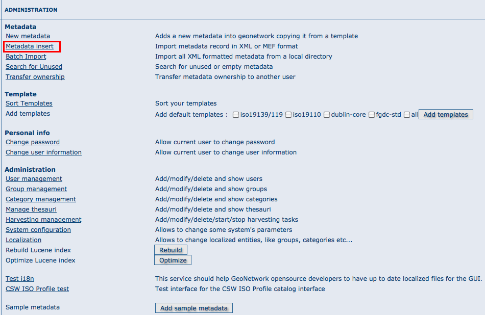
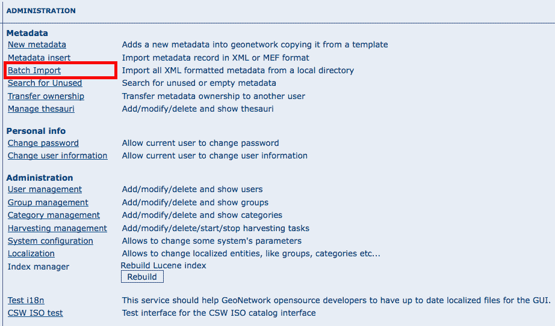

.. _import1:

Import facilities
=================

.. index:: pair: MEF; import
.. index:: pair: XML; import

File import
-----------

The file import facility allows you to import metadata records in XML format or MEF format or copy/paste XML metadata to insert. In order to use this facility, you have to be logged in as an editor. After the login step, go to the administration page and select the Metadata insert link.



Clicking the link, you will open the metadata import page. You have to specify a set of parameters to make the import working. Depending on the insert type you will perform:

XML file import
```````````````

.. figure:: xmlfileimport-options.png

    *The XML file import options*

For both, XML and MEF file import, you could choose actions to be performed at import.
Import actions options are: *No action on import* (nothing
done during import process), *Overwrite metadata with same UUID*
(this option will delete existing metadata with the same UUID, and add the new one),
*Generate UUID for inserted metadata* (this option will force a new
UUID for each metadata inserted).

Stylesheet option: This is a powerful option because allows you to specify a stylesheet for
an XSL transformation. The drop down control is filled with files taken from the
web/xsl/conversion/import folder: all XSL files you put there will be made available.
This is a dynamic process so you don’t have to  restart GeoNetwork. The purpose of this option
is to allow the conversion of a metadata into a suitable format that is supported by GeoNetwork.
Validate option: This is a simple validation step that you can choose to perform.
The metadata is validated against its schema. Group option: You have to select a group to
associate to the imported metadata. Usually the group is the creator of the metadata set.
Category option: You can specify one category to associate to your metadata in order to
simplify the search.

MEF file import
```````````````

.. figure:: meffileimport-options.png

    *The MEF file import options*

As presented before, only actions options could be selected during a MEF import.

XML metadata insert
```````````````````

.. figure:: xmlinsert-options.png

    *The XML insert options*

Choosing the radio button Copy/Paste, you could perform an XML insert, directly copy/pasting
your metadata record. Please refer to XML import for options you could use.

Batch import
------------

The batch import facility allows you to import a set of metadata into the
system all at once. In order to use this facility, you have to be logged in as
an administrator. After the login step, go to the administration page and select
the batch import’s link.



    *How to reach the batch import page*

Clicking the link will open the batch import page. You have to specify a set of parameters to make the import working.
They are:

Directory This is the full path on the server’s file system of the directory
to scan. GeoNetwork will look for and try to import all XML or MEF files present 
into this directory. It is important to notice that this is the directory on the
*server* machine and *not* on the client of the user that is doing the import.
Import actions options are also available from bacth import (please refer to
XML import for options you could use). Validate This is a simple validation 
step that you can choose to perform. The metadata is validated
against its schema. Group You have to select a group to associate to the
imported metadata. Usually the group is the creator of the metadata set.
Category You can specify one category to associate to your metadata in order to
simplify the search. Stylesheet This is a powerful option because allows you to
specify a stylesheet for an XSL transformation. The drop down control is filled
with files taken from the web/xsl/conversion/import folder: all XSL files you
put there will be made available. This is a dynamic process so you don’t have to
restart GeoNetwork. The purpose of this option is to allow the conversion of a
metadata into a suitable format that is supported by GeoNetwork. Therefore, it
is important that the result of the transformation matches the schema format
selected above.

Below the page, there are the following buttons:

Back Goes back to the administration form. Upload Starts the import process.
When the process ends, the total count of imported metadata will be shown.
Please notice that the import is transactional: the metadata set will be fully
imported or fully discarded (there are no partial imports). Files that starts
with ’.’ or that do not end with ’.xml’ are ignored.

.. figure:: web-batchimport-options.png

    *The batch import options*

Structured import
`````````````````

An hidden feature of the batch import is the possibility to specify some
import parameters in more detail. This feature is triggered when the
specified folder contains the import-config.xml file. When this happen, this
file is read and the standard import switches to the structured one.

The import-config.xml file has a config root element with the following children:

#.  categoryMapping \[1]: this element specifies the mapping of
    directories to categories.
    
    #.  mapping \[0..n]: This element can appear 0 or more times
        and maps one directory name to a category name. It must have
        a dir attribute that indicates the directory and a to
        attribute that indicates the category name.
    #.  default \[1]: This element specifies a default mapping of
        categories for all directories that do not match the other
        mapping elements. It must have only the to attribute.

#.  schemaMapping \[1]: this element specifies the mapping of
    directories to metadata schemas.
    
    #.  mapping \[0..n]: This element can appear 0 or more times
        and maps one directory to the schema name that must be used
        when importing. The provided schema must match the one used
        by the metadata contained into the specified directory,
        which must all have the same schema. It must have a dir
        attribute that indicates the directory and a to attribute
        that indicates the schema name.
        
    #.  default \[1]: default behaviour to use when all other
        mapping elements do not match. It must have only the to
        attribute.

Here is an example of the import-config.xml file:

.. sourcecode:: xml

	<config>
		<categoryMapping>
			<mapping dir="1" to="maps" />
			<mapping dir="3" to="datasets" />
			<mapping dir="6" to="interactiveResources" />
			<mapping dir="30" to="photo" />
			<default to="maps" />
		</categoryMapping>
		<schemaMapping>
			<mapping dir="3" to="fgdc-std" />
			<default to="dublin-core" />
		</schemaMapping>
	</config>

The import procedure starts by scanning the provided directory. This can
contain, beside the import-config.xml file, only subdirectories which name
will be ignored but used only as a container. Inside each directory, there
is another level made only by directories that represent a metadata grouping
for categories. Each directory name will be used as the dir attribute in the
mapping scheme previously described.


