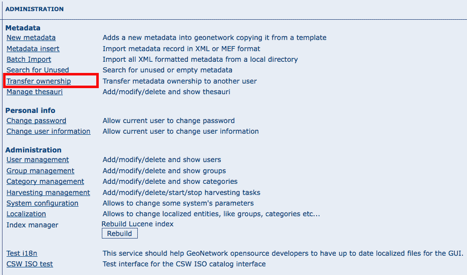

.. _ownership:

Metadata ownership
==================

Introduction
------------

Starting from release 2.1.0, GeoNetwork has a new metadata access policy. The old
edit and admin privileges have been removed and the concept of reviewer has been
introduced. The purpose of this new profile is to control when a metadata can be
published outside or not. In previous releases, all users belonging to a group with
edit privileges could edit the same metadata. Now, a metadata is only visible to its
creator, to a reviewer which has access to the group owner and to an
administrator.

Access policy
-------------

A public metadata is a metadata that has the view privilege for the group named all.

Visualisation
`````````````

An administrator can view any metadata.

A reviewer can view a metadata if:

#. The metadata owner is member of one of the groups assigned to the reviewer.

#. She/he is the metadata owner.

A user administrator or an editor can view:

#. All metadata that has the view privilege selected for one of the groups she/he is member of.

#. All metadata created by her/him.

A registered user can view:

#. All metadata that has the view privilege selected for one of the groups she/he is member of.

Public metadata can be viewed by any user (logged in or not).

Editing
```````

An administrator can edit any metadata.

A reviewer can edit a metadata if:

#. The metadata owner is member of one of the groups assigned to the reviewer.

#. She/he is the metadata owner.

A User Administrator or an Editor can only edit metadata she/he created.

Privileges
----------

The Privileges administration page is accessible only by:

#. All Administrators

#. All Reviewers that are member of one of the groups assigned to the metadata owner.

#. The Owner of the metadata

Privileges for the All and Intranet groups can only be edited by Administrators and Reviewers.

Transfer Ownership
------------------

When metadata ownership needs to be transferred from one user to another for all or specific metadata records, the Transfer Ownership option is available. It is located in the Administration page and once selected, leads to the following page.



    *How to open the Transfer Ownership page*

Initially, the page shows only a dropdown for a Source editor (the current metadata owner). The dropdown is filled with all GeoNetwork Users that have the Editor role and own some metadata. Selecting an Editor will select all metadata that is managed by that Editor. An empty dropdown means that there are no Editors with metadata associated and hence no transfer is possible.

Note The drop down will be filled with all Editors visible to you. If you are not an Administrator, you will view only a subset of all Editors.

.. figure:: web-ownership-options.png

    *The Transfer Ownership page*

Once a Source Editor has been selected, a set of rows is displayed. Each row refers to the group of the Editor for which there are privileges. The meaning of each column is the following:

#. *Source group*: This is a group that has privileges in the metadata that belong to the source editor. Put in another way, if one of the editor’s metadata has privileges for one group, that group is listed here.

#. *Target group*: This is the destination group of the transferring process. All privileges relative to the source group are transferred to the target group. The target group drop down is filled with all groups visible to the logged user (typically an administrator or a user administrator). By default, the Source group is selected in the target dropdown. Privileges to groups All and Intranet are not transferable.

#. *Target editor*: Once a Target group is selected, this drop down is filled with all editors that belong to that Target group.

#.  *Operation*: Currently only the Transfer operation is possible.

By selecting the Transfer operation, if the Source group is different than the Target group, the system performs the Transfer of Ownership, shows a brief summary and removes the current row because now there are no privileges to transfer anymore.


