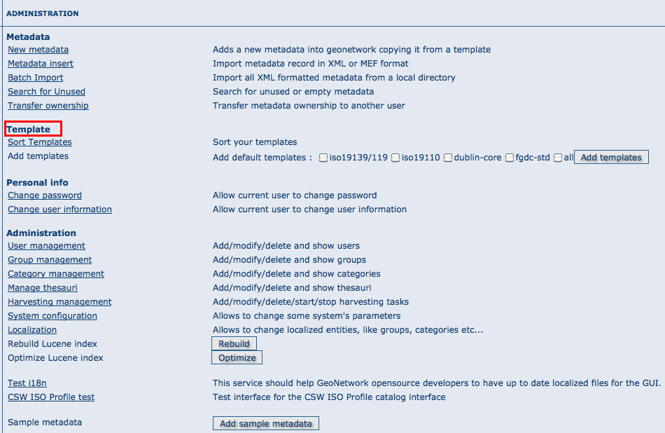
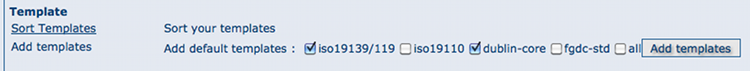

.. _templates:

Templates
=========

The templates options allows to manage the metadata templates in the catalog. In order to use these 
facilities, you have to be logged in as an administrator. After the login step, go to the administration 
page.

Sort templates
--------------

This option allows to set the order of the templates avalaible when creating a new metadata.

.. figure:: templates-newmetadata.png

In the administration panel, select Sort Templates option:

.. figure:: templates-sort.png

The list of avalaible templates is shown with the current display order. To change the position of a 
template click on it's name and drag it to move it to the new position. 

Once the order of templates is configured, click on Save button to save the changes. To cancel the 
changes and return to the administration form click on Back button.

Add templates
-------------

This option allows the user to select the metadata templates to add in the catalog to create new metadata
records. 

Mark the metadata templates to import and click Add templates button to import them in the catalog 
and make them are avaliable when creating new metadata records.