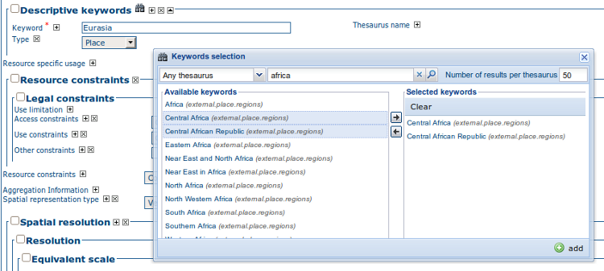

.. _thesaurus:

Thesaurus
=========

Introduction
------------

Thesaurus support in GeoNetwork allows:

- *Metadata editing*: controlled vocabulary on the metadata editing interface for ISO and Dublin Core

- *Administration interface* allows import/export/creation/browse thesaurus

- *Search interface*: a list of keyword is proposed for the keyword criteria

On a node, thesaurus types could be defined as:

- *External*: When a thesaurus is imported, it is flagged to ”external” which means that users are not allowed to edit the thesaurus. This thesaurus is managed by an external organisation.

- *Local*: When a thesaurus is created, it is flagged to ”local” which means that users are allowed to edit the thesaurus.

Thesaurus / SKOS format
-----------------------

The Simple Knowledge Organisation Systems (SKOS) http://www.w3.org/2004/02/skos/ is an area of work developing specifications and standards to support the use of knowledge organisation systems (KOS) such as thesauri, classification schemes. This format is used by GeoNetwork to store thesaurus information.

A concept is defined by an identifier, a preferred label, a definition and links with other concepts. Labels and definitions could be stored in multiple languages (using the xml:lang attributes). Three type of links between concepts have been defined in the SKOS format:

- related terms
- broader terms
- narrower terms

For example, a concept ”ABLETTE” could be defined as follow with a label in French and English, linked to broader concept::

    <skos:Concept rdf:about="http://www.oieau.org/concept#c4fc54576dc00227b82a709287ac3681">
        <skos:prefLabel xml:lang="fr">ABLETTE</skos:prefLabel>
        <skos:prefLabel xml:lang="en">BLEAK</skos:prefLabel>
        <skos:broader rdf:resource="http://www.oieau.org/concept#9f25ece36d04776e09492c66627cccb9"/>
    </skos:Concept>

GeoNetwork support multilingual thesaurus (e.g. Agrovoc). Search and edition are made based on current user interface language (i.e. if the interface is in English, when editing metadata, GeoNetwork will only search for concept in English).

Thesaurus administration
------------------------

To reach the thesaurus administration page you have to be logged in as an administrator. From the administration page, click the link ”Manage thesauri”. The page shows a list of thesaurus that have been created or imported. The upper part of the page allows user to edit/add/modify/consult thesaurus. The lower part allows upload of thesaurus in SKOS format.

Creation of a new thesaurus
```````````````````````````

To create a new thesaurus, click the ”+” sign in the category you want your
thesaurus to be in. Once created, the thesaurus could be updated through the
edit interface. The meaning of each column is as follows:

- **Type** - The type allows to classify thesaurus according to its type. First, is defined the type of the thesaurus following ISO category list, then the type indicates if the thesaurus is a local one or an external one.
- **Name** - This is the thesaurus’s name provided by the administrator on creation or filename on upload. When creating a thesaurus, the name of the thesaurus will be the filename of the thesaurus.

.. figure:: thesaurus-Admin.png

    *Administration interface for thesaurus*

For each thesaurus the following buttons are available:

- **Download** - Link to the RFD file.
- **Delete** - Remove thesaurus from the current node.
- **View** - If type is external, the view button allows to search and view concepts.
- **Edit** - If type is local, the edit button allows to search, add, remove and view concepts.

Import existing thesaurus
`````````````````````````

GeoNetwork allows thesaurus import in SKOS format. Once uploaded, an external thesaurus could not be updated. Select the category, browse for the thesaurus file and click upload. The file is located in /web/xml/codelist/external/thesauri/category/.

.. figure:: thesaurus-upload.png

    *Upload interface for thesaurus*

At the bottom of the page there are the following buttons:

#. *Back*: Go back to the main administration page.

#. *Upload*: Upload the selected RFD file to the node. Then it will list all thesaurus available on the node.

Editing/browsing thesaurus: add/remove/browse keywords
------------------------------------------------------

From the thesaurus administration interface, click on the edit button for a local thesaurus or the view button for an external thesaurus. This interface allows:

- keywords search
- add/remove keywords for local thesaurus.

Use the textbox and the type of search in order to search for keywords.

.. figure:: thesaurus-KeywordSearch.png

    *Browse interface for thesaurus*

.. figure:: thesaurus-KeywordDesc.png

    *Keyword description*

Metadata editing: adding keywords
---------------------------------

When editing metadata in ISO, it allows editors to:
- do one or more searches in all thesaurus registered in the catalogue.
- select one or more keywords added to the selected items list (using arrows or drag & drop) on the right.
- add the selected keywords directly into metadata, grouping keywords by thesaurus.

The search interface allows editors to choose the maximum number of keywords to returns, 
and the thesaurus to search into (default is all).



    *Keyword selection interface (editing mode)*

.. figure:: thesaurus-KeywordView.png

    *Keyword selection (view mode)*

Search criteria: keywords
-------------------------

In the advanced search interface, search for keyword is available.

By default, the keyword field will proposed all keywords used in the metadata. 
These keywords are indexed by Lucene on creation/update of metadata. 
The number of metadata linked to all keywords available in the index are
display. User could type in the keyword field or click the icon to get the list of
keywords available.

.. figure:: thesaurus-SearchInterface.png

    *Thesaurus search interface*

.. figure:: thesaurus-SearchKeywordAutocomp.png

    *Auto-complete function in thesaurus search interface*

By configuring the *config-gui.xml* file in the WEB-INF directory, search for keyword 
using the advanced keyword selection panel is available as in the metadata editor::
  
 <search>
  <!-- Display or not keyword selection panel in advanced search panel 
   <keyword-selection-panel/> 
  -->
 </search>


